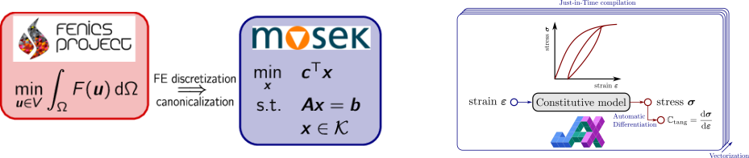
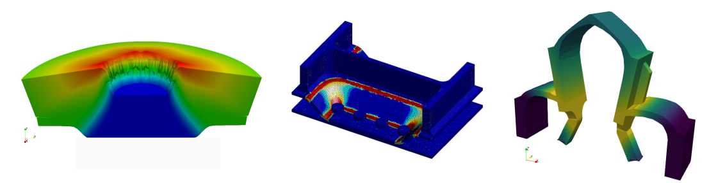
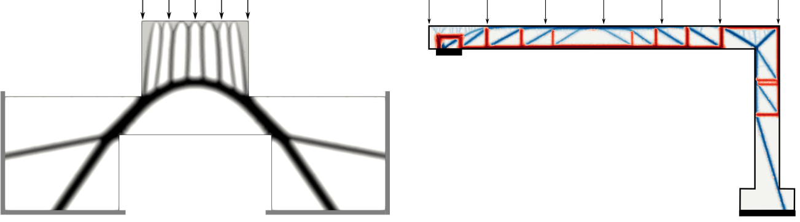
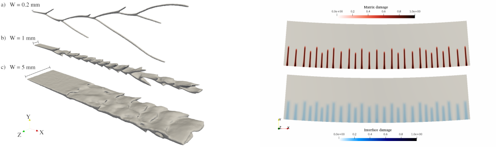




## Automated nonlinear mechanics with FEniCS

  

Part of my activities revolves around the overarching goal of automating nonlinear mechanics simulations using modern computational tools. I am heavily involved in developing a computational ecosystem for nonlinear mechanics within the  [FEniCS](https://fenicsproject.org) environment. pecifically, by harnessing FEniCS' automation capabilities for formulating partial differential equations (PDEs), it is now possible to easily implement numerical solutions to complex nonlinear and multiphysics problems. You can find more details in my [Numerical tours](https://bleyerj.github.io/comet-fenicsx/). 

One of the main challenges in using FEniCS in a nonlinear mechanics setting is the difficulty in natively handling implicit constitutive laws, which frequently arise for complex materials. To address this issue, I am developing a set of numerical tools to integrate FEniCS with external libraries, including material behavior code generators such as MFront, machine learning libraries with Automatic Differentiation features, and conic optimization solvers. You can find further details in the [Software](../_pages/software.md) section.
All these developments are open-source and have led to various collaborations focusing on very different applications including:
- viscoplastic fluids 
- submarine landslides
- shape changes of biological cells
- microstructure evolution in laser additive manufacturing

## Analysis of structural failure through limit analysis

  

I am focused on implementing limit analysis theory numerically for civil engineering applications. This theory estimates a structure's ultimate load, accounting for material strength, and providing lower and upper load bounds based on stress and displacement variational principles. However, implementing this theory poses challenges due to complex, non-smooth, and large-scale convex optimization problems, which are addressed with conic programming and interior-point algorithms. I have contributed to developing these approaches for beams, plates, and shells, utilizing original finite element formulations and multiscale strategies for strength criteria. These advancements now utilize the open-source finite element library FEniCS, enabling automated limit analysis for various mechanical models.

These developments have been applied to civil engineering challenges in collaboration with partners such as the engineering firm [Strains](https://strains.fr/) and [Centre Scientifique et Technique du Bâtiment - CSTB](http://www.cstb.fr/fr/). Applications include the analysis of 3D steel joints, massive reinforced concrete structures, reinforced concrete beams and high-rise panels under fire conditions.

## Shape and topology optimization

  

Recently, my research has expanded into the field of shape optimization, aiming to discover an optimal shape for a structure to enhance mechanical performance within a specified volume of material. We have introduced an original formulation to maximize a structure's ultimate load-carrying capacity. This extension is versatile and utilizes convex optimization tools to address materials lacking tensile strength, such as masonry or anisotropic reinforced materials. This work has facilitated the automated generation of strut-and-tie models for reinforced concrete structure design, paving the way for numerous extensions to accommodate different material behaviors and the form-finding of optimal vaults for curved structures.

## Models of brittle fracture and regularization

  

Another aspect of my research focuses on developing models to predict failure in heterogeneous materials. For instance, in fiber-reinforced materials or multi-layered composite plates, I utilize generalized models that independently describe the kinematics of each phase or layer. Employing well-chosen homogenization procedures facilitates the proposal of models coupling various failure mechanisms, such as matrix cracking and delamination. Modeling brittle failure in continuous media presents significant challenges due to the ill-posed nature of the problem. Phase-field/damage gradient models represent one of the most satisfactory methods for regularization. I have investigated such models within the context of rapid dynamics and their correlation to branching instabilities of cracks. Additionally, I have explored anisotropic fracture involving multiple phase fields to discern different failure modes, such as transverse or matrix cracking.

<!-- 
  
 -->

